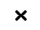
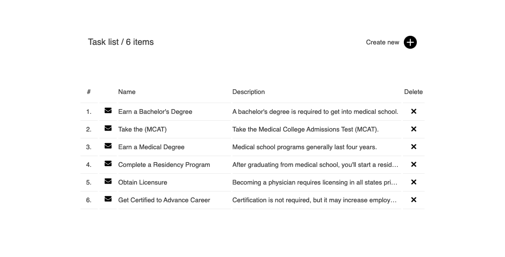
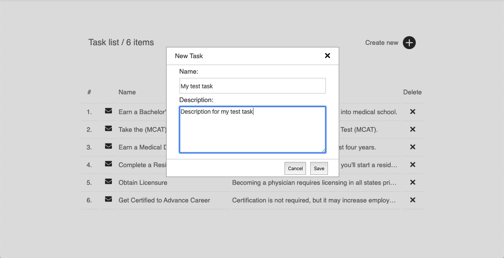

### Тестовое задание: «Список задач»
Необходимо реализовать на чистом JavaScript или React.js список задач.
Список должен содержать следующие столбцы: **number**, **object icon**, **name**, **description**, **delete icon**;
Должна быть возможность удалять элементы из списка по клику по иконке 

Скриншот потобного списка: 

Для того чтоб создать новый элемент списка нужно кликнуть по иконке 
Должно открыться модальное окно в котором должны быть два поля ввода для **name** и **description**. Данные сохраняются и добавляются в список по клику по кнопке **Save**, окно закрывается.
Кнопка **Cancel** и крестик просто закрывют модальное окно без сохранения.

Скриншот модального окна:

Данные для спика нужно хранить в **localStorage** чтоб при перезагрузке страницы они не терялись и была возможность продолжить работу с списком задач.
Код тестового задания необходимо выложить на у себя на [https://github.com/](https://github.com/) и дать ссылку. Важно соблюдать историю коммитов и давать им понятное описание.
Мы не предявляем никаких требований к стилизация списка, модального окна и т.д. Это остается на усмотрении разработчика.
Иконки можно взять здесь: [иконки](./icons/)

### При реализации тестового задания будет плюсом:
1) Использовать для постороения UI, библиотеку [React.js](https://reactjs.org/)
2) Использовать сборщик модулей [Webpack](https://webpack.js.org/)
3) Использовать [Bootstrap](https://getbootstrap.com/) в качестве css фреймворка (не использовать Bootstrap.js, только CSS)
4) Сбилдить и выложить приложение на [GitHub pages](https://pages.github.com/)

##### Удачи!